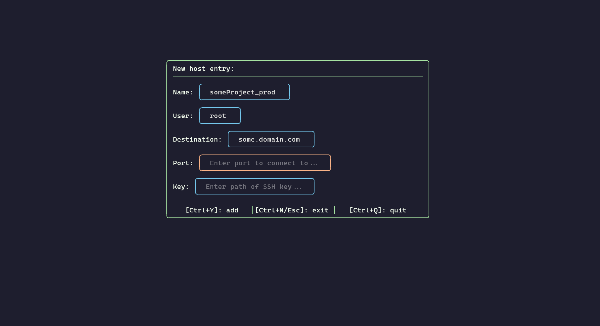

# ssh-tui
Ssh-tui is a sleek and minimal terminal user interface for managing SSH connections.

## Screenshots



## Features
- Quickly filter through SSH connections
- Manage SSH connections from within the TUI (add, edit, delete)
- Connections get stored in your `~/.ssh/config` file

## Requirements
- Python 3.11+
- [textual](https://github.com/Textualize/textual)
- [rich](https://github.com/Textualize/rich)
- A [functional `~/.ssh/config file`](https://gist.github.com/numberwhun/d986bb536af15c5fccdcd5dfa656e4a1) (can be empty or non-existent)
> [!TIP]
> textual and rich are automatically installed as dependencies when you initialize ssh-tui using `pip`.

## Installation
```shell
git clone git@github.com:flottegurke/ssh-tui.git
cd ssh-tui
pip install .
```

## Usage
```shell
ssh-tui
```
- `Typing`: Filter / Search connections
- `Arrow Up/Down`: Navigate through results (connections)
- `Enter`: Connect to selected connection
- `Ctrl+C / Ctrl+Q / Esc`: Quitt the application
- `Ctrl+A`: Add a new connection
- `Ctrl+E`: Edit the selected connection
- `Ctrl+D`: Delete the selected connection
- While popup menus are open:
  - `Tab / Shift+Tab`: Navigate between inputs
  - `Ctrl+Y`: Submit the form
  - `Ctrl+N / Esc`: Cancel the form
  - `Ctrl+Q`: Quit the application

## Credits
- Layout: inspired by [sshs](https://github.com/quantumsheep/sshs)
- Theme: [Catppuccin Mocha](https://github.com/catppuccin/catppuccin)
